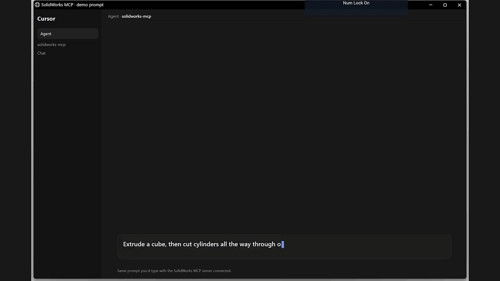

# SolidWorks MCP

Talk to an AI assistant about your SolidWorks work, and let it drive the CAD session for you.

Open assemblies, inspect mates, move parts, measure geometry, export files, and more. You stay in charge of what looks right. The assistant uses this project as the bridge into SolidWorks on Windows.

You do not need to write macros or learn the SolidWorks API. If you can describe the job in plain language, you can use this.

> **Needs:** Windows · a licensed SolidWorks install · [Cursor](https://cursor.com) (or another MCP client) · Node.js 20+ · .NET 8 SDK  
> SolidWorks should be open (or able to launch) on the same desktop as the assistant.

## Workflow

1. Open your part or assembly in SolidWorks.
2. In Cursor, ask for the change you want.
3. The assistant drives SolidWorks through this server.
4. Check the model, then confirm before it saves.

Examples you can ask:

- "List the mates on this assembly and tell me which ones are failing."
- "Measure the distance between these two faces."
- "Add a coincident mate between the flange face and the bracket face."
- "Export a PNG of the current view so I can check the pose."
- "Extrude a cube, then cut cylinders all the way through on each face."
- "Save a checkpoint before we change anything."

Destructive steps (delete mates, replace components, and similar) ask for an explicit confirm. Meaningful edit cycles should end with your "yes" before a hard save.

## Set up once

Do this on the Windows machine that runs SolidWorks.

### 1. Install the tooling

Install [Node.js 20+](https://nodejs.org/) and the [.NET 8 SDK](https://dotnet.microsoft.com/download). You can leave them alone after that. They only need to be present so this project can talk to SolidWorks.

### 2. Get the project and build it

In PowerShell:

```powershell
git clone https://github.com/jaylamping/solidworks-mcp.git
cd solidworks-mcp
npm install
npm run build
```

### 3. Check that SolidWorks is reachable

Start SolidWorks from the Start Menu, then run:

```powershell
npm run worker:status
```

You should see a live connection and, if a document is open, its title and path. If the check fails, open SolidWorks once by hand and try again.

### 4. Connect Cursor

In Cursor MCP settings (or a project `.cursor/mcp.json`), point a server at your clone. Replace the path with your real folder:

```json
{
  "mcpServers": {
    "solidworks": {
      "command": "node",
      "args": [
        "C:/path/to/solidworks-mcp/node_modules/tsx/dist/cli.mjs",
        "C:/path/to/solidworks-mcp/src/index.ts"
      ],
      "env": {
        "SOLIDWORKS_MCP_TOOL_TIER": "extended",
        "SOLIDWORKS_MCP_ALLOWED_ROOTS": "C:/cad;D:/projects;C:/path/to/solidworks-mcp/.demo",
        "SOLIDWORKS_MCP_PERSISTENT_WORKER": "1"
      }
    }
  }
}
```

What those settings mean:

| Setting | Plain meaning |
|---------|----------------|
| `SOLIDWORKS_MCP_ALLOWED_ROOTS` | Folders the assistant is allowed to open or save under. Use your CAD library paths. Include `<clone>/.demo` if you want the demo part saved there. Separate with `;`. The document already open in SolidWorks is trusted even if you skip this. |
| `SOLIDWORKS_MCP_TOOL_TIER` | How many tools to expose. `extended` is a good daily default. `all` shows everything. |
| `SOLIDWORKS_MCP_PERSISTENT_WORKER` | Keep one warm worker process. Faster tool calls. Recommended for interactive CAD work. |

After you save the config, reload MCP / restart Cursor so it picks up the server.

**Important:** do not ask the assistant to run many SolidWorks tools at once in parallel. SolidWorks COM is single-threaded. Call tools one at a time.

## Try the demo

With SolidWorks open and MCP connected, ask:

> Extrude a cube, then cut cylinders all the way through on each face.

[](https://github.com/jaylamping/solidworks-mcp/blob/main/docs/assets/demo-build-part.mp4)

Or from the repo: `npm run demo:build-part`.

## What the assistant can do

There are 100+ tools. Broadly:

| Area | Examples |
|------|----------|
| Documents | Open, save, close, rebuild, pack-and-go, export |
| Assemblies | List components, transforms, interference, BOM, degrees of freedom |
| Mates | Coincident, distance, parallel, perpendicular, width, limit angle, suppress or delete |
| Modeling | Sketches, extrude/cut, fillet/chamfer, patterns, mirror |
| Measure / inspect | Mass properties, measure, feature and body boxes, stable face references |
| Selection | Use what you clicked in SolidWorks, or pick by ray / persist reference |
| Robot / URDF helpers | Readiness check, add coordinate-system frames |
| Escape hatches | Low-level API invoke, API doc search |

Ask the assistant to search tools with `solidworks_search_tools`, or browse generated pages under [`docs/api/`](docs/api/).

## Safety habits that matter in the shop

- Prefer a checkpoint before risky edits. Mutating tools often stage one automatically under `.checkpoints/` next to the document.
- After a change, look at the model or a PNG export and answer "Does this look good?" before a final save.
- Lock-in for assemblies goes through `confirm_and_save`, which rebuilds, checks mate health, saves, and reopens to prove the pose stayed put.
- Paths outside `SOLIDWORKS_MCP_ALLOWED_ROOTS` are rejected on purpose so the assistant cannot wander the disk.

More detail: [Troubleshooting](docs/troubleshooting.md).

---

## For developers

### Architecture

```text
Cursor (or other MCP client)
  → Node (TypeScript MCP server)
  → SolidWorksComWorker (.NET 8, STA)
  → SolidWorks COM
```

- **Node** owns MCP protocol, tool catalog, path guards, and the worker session.
- **Worker** attaches to `SldWorks.Application` and runs commands. Default is one process per call. Set `SOLIDWORKS_MCP_PERSISTENT_WORKER=1` (or `SOLIDWORKS_MCP_WORKER_MODE=session`) for a long-lived NDJSON session.
- **Tool metadata** lives in `src/tool-spec/catalog.ts`. Run `npm run generate:tools` to refresh the manifest and generated C# policy. Do not hand-edit generated allowlists.

### Environment variables

| Variable | Purpose |
|----------|---------|
| `SOLIDWORKS_MCP_ALLOWED_ROOTS` | Semicolon-separated directories allowed for open/save/export paths |
| `SOLIDWORKS_MCP_TOOL_TIER` | `core` / `extended` / `advanced` / `debug` / `all` |
| `SOLIDWORKS_MCP_INVOKE_WRITE` | Allow write members through `solidworks_invoke` |
| `SOLIDWORKS_MCP_PERSISTENT_WORKER` | `1` for the warm session worker |
| `SOLIDWORKS_MCP_WORKER_MODE` | `session` for the same path; omit for ephemeral oneshot |
| `SOLIDWORKS_MCP_AUTO_CHECKPOINT` | `0` to disable auto pre-change checkpoints |
| `SOLIDWORKS_MCP_CHECKPOINT_DEBOUNCE_SEC` | Reuse window for checkpoints (default `45`) |

### Checks

```powershell
npm run typecheck
npm run build
npm run generate:tools -- --check
npm run check:safety
npm run check:schemas
npm run validate:tools
npm run demo:build-part
```

`validate:tools` smoke-probes the API and worker. It reports a missing SolidWorks session without needing a particular CAD workspace. `demo:build-part` needs a live SolidWorks session and writes under `.demo/`. `demo:record-video` captures the SolidWorks window into `docs/assets/` (needs `ffmpeg`).

### Further reading

- [Troubleshooting](docs/troubleshooting.md)
- [Error catalog](docs/errors/README.md)
- [CAD automation notes](docs/cad-automation.md)
- [COM invoke ABI](docs/com-invoke-abi.md)
- [API reference corpus](docs/api-reference/README.md) (generated / scraped locally)

## License

MIT — see [LICENSE](LICENSE).

SolidWorks® is a trademark of Dassault Systèmes. This project is not affiliated with or endorsed by Dassault Systèmes.
